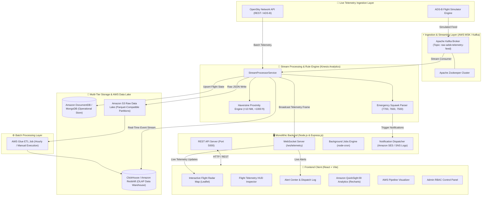

# Real-Time Flight Telemetry & Tracking System
## Comprehensive Technical & Architectural Documentation

---

## 1. Executive Summary & System Overview

The **Real-Time Flight Telemetry & Tracking System** is an enterprise-grade, high-performance web application and data analytics platform designed for real-time airspace visualization, flight monitoring, collision hazard detection, and big data analytics. Built upon a monolithic **MERN (MongoDB/DocumentDB, Express.js, React, Node.js)** architecture, the application integrates simulated and live **AWS Data Analytics Cloud Pipelines** incorporating **Amazon MSK (Apache Kafka)**, **Amazon Kinesis Data Analytics**, **Amazon DocumentDB**, **Amazon S3 Data Lake**, **AWS Glue ETL**, **Amazon Redshift / ClickHouse Data Warehouse**, **Amazon SES/SNS**, and **Amazon QuickSight BI**.

### System Capabilities & Highlights
- **Live Airspace Visualization**: Tracks 500+ global aircraft simultaneously on an interactive Leaflet radar map with smooth 60 FPS physics-based dead-reckoning interpolation.
- **Dual Telemetry Ingestion Engine**: Dynamically switches between the live **OpenSky Network REST API** (with automatic rate-limit detection and `Retry-After` header compliance) and a background **ADS-B Flight Simulator**.
- **Proximity Breach & Emergency Rule Engine**: Calculates real-time lateral (Haversine in Nautical Miles) and vertical separation between aircraft, automatically triggering critical alerts for proximity violations (< 10 NM lateral & < 1,000 ft vertical) and emergency squawk codes (`7700` MAYDAY, `7600` Radio Loss, `7500` Hijack).
- **Automated AWS Analytics Pipeline**: Streams raw telemetry through Kafka topics, ingests data into S3 partitioned by UTC date (`year=YYYY/month=MM/day=DD/hour=HH`), executes batch Glue ETL transformations, and populates OLAP Data Warehouses (ClickHouse / Redshift).
- **Incident Response & Notification System**: Integrates automated notification dispatch logs mimicking **Amazon SES (Email)** and **Amazon SNS (SMS)** for air traffic controllers and dispatch personnel.
- **Role-Based Access Control (RBAC)**: Enforces access policies for seeded user roles (`Admin`, `Analyst`, `Dispatcher`, `Viewer`).

---

## 2. System Architecture & Data Flow



### End-to-End Pipeline Execution Walkthrough
1. **Telemetry Generation & Polling**: Every 20 seconds, the backend polls OpenSky Network API states or runs the internal ADS-B simulator generating updated aircraft positions (lat, lon, altitude, heading, ground speed, squawk).
2. **Kafka Ingestion**: Telemetry batches are serialized into JSON messages and produced to the Apache Kafka topic `raw-adsb-telemetry-feed` (running on Confluent Docker container on port `9093`).
3. **Kinesis Stream Processing**: The Kafka consumer consumes batches, triggering `streamProcessor.js`:
   - **S3 Data Lake Partitioning**: Raw payload files are stored in `data/s3_datalake/year=YYYY/month=MM/day=DD/hour=HH/`.
   - **DocumentDB/MongoDB Sync**: Active flight state documents are upserted into the MongoDB `flights` collection.
   - **Proximity Rule Evaluation**: Calculates pairwise distances between all active aircraft. If lateral distance $\le 10$ NM and vertical separation $\le 1000$ ft, a `CRITICAL` proximity breach alert is written to the database and broadcasted.
   - **Emergency Squawk Detection**: Detects squawk codes `7700`, `7600`, or `7500`, creating an `EMERGENCY` alert and firing mock Amazon SES email and SNS SMS dispatches.
   - **ClickHouse OLAP Ingestion**: Events are written directly into the `flight_telemetry` MergeTree table in ClickHouse.
4. **WebSocket Broadcast**: A unified telemetry payload is emitted over `/ws/telemetry` to connected React clients.
5. **Client Dead-Reckoning**: React receives position snapshots and smoothly interpolates aircraft coordinates at 60 FPS using `requestAnimationFrame` and dead-reckoning equations.

---

## 3. Core Component Features

### 3.1 Interactive Flight Radar Map (`MapView.jsx`)
- **Real-Time Aircraft Rendering**: Displays 500+ active aircraft rotated dynamically based on `headingDeg`.
- **Altitude-Coded Marker Palette**:
  - **FL380+ (High Cruise)**: `#a855f7` (Purple)
  - **FL300–FL370 (Standard Cruise)**: `#06b6d4` (Cyan)
  - **FL200–FL290 (Mid Altitude)**: `#22c55e` (Green)
  - **FL100–FL190 (Low Altitude)**: `#f59e0b` (Amber)
  - **Emergency Squawk**: `#ef4444` (Crimson Pulse)
- **Trajectory Trailing**: Renders smooth polyline paths showing historical flight positions (up to 40 coordinate steps).
- **Airport Pin Overlays**: Interactive airport icons representing key international hubs (JFK, LHR, LAX, SFO, DXB, HND, etc.).
- **Animated Radar Sweep**: Visual sweeping radar overlay giving a live air traffic control terminal radar scope aesthetic.

### 3.2 Telemetry HUD Inspector (`FlightDrawer.jsx`)
- **Live Flight Metrics Gauges**: Instant readouts for altitude (ft), ground speed (kts), heading (°), vertical rate (fpm), and squawk code.
- **Flight Progress Bar**: Calculated flight progress percentage based on origin and destination coordinates.
- **Emergency Action Panel**: Direct control buttons for dispatchers to trigger squawk codes (`7700` MAYDAY, `7600` COMMS LOSS, `7500` HIJACK, `1200` CLEAR).
- **High-Resolution Aircraft Profile**: Photo preview, aircraft type, tail registration, and operating airline flag.

### 3.3 Airspace Alert & Proximity Center (`AlertCenter.jsx`)
- **Live Event Log**: Real-time stream of incoming warnings, emergency declarations, and proximity alerts.
- **Incident Response Workflow**: Dispatchers can review incident details, location coordinates, involved aircraft callsigns, and click **Acknowledge Alert**.
- **Amazon SES & SNS Delivery Logs**: Transparent view of dispatched emergency emails (`Amazon SES`) and SMS notifications (`Amazon SNS`).

### 3.4 AWS Data Analytics Pipeline Visualizer (`AwsPipelineVisualizer.jsx`)
- **Interactive Architecture Flow**: Visual representation of raw data moving from ingest -> MSK Kafka -> Kinesis Stream -> S3 Lake -> Glue ETL -> Redshift/ClickHouse DW -> QuickSight BI.
- **Live Metric Counter**: Real-time throughput numbers for Kafka topics, S3 storage size (MB), processed S3 objects, and Redshift DW row counts.
- **Manual Glue ETL Trigger**: Button allowing administrators to manually trigger an AWS Glue Batch ETL job outside the standard hourly cron schedule.

### 3.5 QuickSight BI Analytics Dashboard (`AnalyticsDashboard.jsx`)
- **Hourly Flight Telemetry Density**: Area chart visualizing flight volume and streaming event ingestion over a 24-hour window.
- **Altitude Band Distribution**: Donut chart analyzing flight cruise levels across FL380+, FL310–370, FL200–300, and terminal areas.
- **Air Corridor Performance**: Horizontal bar charts displaying international flight route density, average flight speeds, and on-time percentages.
- **Delay Factor Root-Cause Analysis**: Breakdown of primary flight delays (ATC Holds, North Atlantic Weather Avoidance, Jet Stream Headwinds, Gate Congestion).

### 3.6 Admin Panel & System Control (`AdminPanel.jsx` & `SimulatorControlPanel.jsx`)
- **Threshold Tuning**: Adjust proximity breach distance (default 10 NM) and vertical separation buffer.
- **Simulation Speed Controls**: Change simulation speed multiplier from `1x` up to `10x`.
- **Manual Flight Injector**: Form allowing operators to inject custom aircraft into the live stream with custom origin, destination, altitude, speed, and callsign.
- **RBAC User Directory**: Manage user roles (`Admin`, `Analyst`, `Dispatcher`, `Viewer`).

---

## 4. Technology Stack & Component Specifications

| Tier | Technology / Library | Purpose & Description |
| :--- | :--- | :--- |
| **Frontend Core** | React 18 + Vite | SPA framework with fast HMR build setup |
| **Mapping & GIS** | Leaflet 1.9 + React-Leaflet | Open-source interactive map rendering |
| **Data Visualization** | Recharts | SVG chart suite for QuickSight BI dashboard |
| **Icons & UI Styling** | Lucide React + Vanilla CSS | Dark glassmorphic aviation design system (`index.css`) |
| **Backend Runtime** | Node.js (v18+/v24+) + Express.js | Monolithic server framework hosting REST API and WebSockets |
| **WebSocket Engine** | `ws` (WebSocket Protocol) | Full-duplex real-time telemetry streaming server (`/ws/telemetry`) |
| **Operational Database** | MongoDB 6.0 / Mongoose | Document database for flights, alerts, users, and airspace configs |
| **In-Memory Fallback DB** | `mongodb-memory-server` | Zero-configuration local database for quick setup |
| **Message Broker** | Apache Kafka (`kafkajs`) | Event streaming platform simulating Amazon MSK |
| **OLAP Data Warehouse** | ClickHouse (`@clickhouse/client`) | High-speed analytical database simulating Amazon Redshift |
| **Scheduler** | `node-cron` | Background job execution engine for batch ETL and aggregations |
| **Authentication** | JSON Web Tokens (`jsonwebtoken`) + `bcryptjs` | JWT header authentication with salted password hashing |
| **Containerization** | Docker & Docker Compose | Multi-container setup (MongoDB, Zookeeper, Kafka, ClickHouse) |

---

## 5. Database Models & Schemas

### 5.1 Flight Schema (`server/models/Flight.js`)
```javascript
{
  flightId: { type: String, required: true, unique: true, index: true },
  icao24: { type: String, required: true, index: true },
  callsign: { type: String, required: true },
  airline: { type: String, required: true },
  aircraftType: { type: String, default: 'Boeing 787-9' },
  registration: { type: String, default: 'N104AN' },
  countryFlag: { type: String, default: '🇺🇸' },
  photoUrl: { type: String },
  origin: {
    code: String, city: String, country: String, lat: Number, lon: Number
  },
  destination: {
    code: String, city: String, country: String, lat: Number, lon: Number
  },
  currentPosition: {
    lat: { type: Number, required: true, index: true },
    lon: { type: Number, required: true, index: true },
    altitudeFt: Number,
    speedKnots: Number,
    headingDeg: Number,
    verticalRateFpm: Number
  },
  squawk: { type: String, default: '1200' },
  status: {
    type: String,
    enum: ['Scheduled', 'Taxing', 'In-Flight', 'Approaching', 'Landed', 'Emergency', 'Diverted'],
    default: 'In-Flight'
  },
  progressPct: { type: Number, default: 0 },
  trajectory: [{ lat: Number, lon: Number, altitudeFt: Number, speedKnots: Number, timestamp: Date }],
  weatherTurbulence: { type: String, enum: ['None', 'Light', 'Moderate', 'Severe'], default: 'None' },
  lastTelemetryUpdate: { type: Date, default: Date.now, index: true }
}
```

### 5.2 Alert Schema (`server/models/Alert.js`)
```javascript
{
  alertId: { type: String, required: true, unique: true },
  type: {
    type: String,
    enum: ['ProximityBreach', 'EmergencySquawk', 'RouteDeviation', 'AltitudeViolation', 'TurbulenceAlert', 'SystemNotice'],
    required: true
  },
  severity: { type: String, enum: ['INFO', 'WARNING', 'CRITICAL', 'EMERGENCY'], default: 'WARNING' },
  flightId: { type: String, required: true, index: true },
  callsign: { type: String, required: true },
  secondaryFlightId: String,
  secondaryCallsign: String,
  distanceNM: Number,
  squawkCode: String,
  message: { type: String, required: true },
  location: { lat: Number, lon: Number, altitudeFt: Number },
  acknowledged: { type: Boolean, default: false },
  acknowledgedBy: String,
  acknowledgedAt: Date,
  status: { type: String, enum: ['Active', 'Resolved', 'Dismissed'], default: 'Active' }
}
```

### 5.3 User Schema (`server/models/User.js`)
```javascript
{
  username: { type: String, required: true, unique: true },
  email: { type: String, required: true, unique: true },
  password: { type: String, required: true },
  role: { type: String, enum: ['Admin', 'Analyst', 'Dispatcher', 'Viewer'], default: 'Analyst' },
  department: { type: String, default: 'Flight Operations' },
  preferences: {
    theme: { type: String, default: 'dark' },
    notificationsEnabled: { type: Boolean, default: true },
    proximityAlertDistanceNM: { type: Number, default: 10 }
  }
}
```

### 5.4 Airspace Configuration Schema (`server/models/AirspaceConfig.js`)
```javascript
{
  configId: { type: String, default: 'default_config', unique: true },
  proximityAlertDistanceNM: { type: Number, default: 10.0 },
  minAltitudeFt: { type: Number, default: 1000 },
  maxAltitudeFt: { type: Number, default: 45000 },
  simulationSpeedMultiplier: { type: Number, default: 1.0 },
  autoNotificationEmail: { type: Boolean, default: true },
  autoNotificationSMS: { type: Boolean, default: true },
  s3RetentionDays: { type: Number, default: 90 },
  glueEtlSchedule: { type: String, default: 'Every 1 Hour' },
  weatherOverlayEnabled: { type: Boolean, default: true }
}
```

---

## 6. API Reference & Specifications

### 6.1 Authentication Endpoints (`/api/auth`)
- `POST /api/auth/login`: Authenticates user credentials and returns JWT bearer token.
  - **Body**: `{ "username": "admin", "password": "admin123" }`
  - **Response**: `{ "success": true, "token": "<JWT_STRING>", "user": {...} }`
- `GET /api/auth/me`: Validates JWT token and returns current session profile.
- `GET /api/auth/users`: Returns registered users list (Admin role restricted).

### 6.2 Flight Telemetry Endpoints (`/api/flights`)
- `GET /api/flights`: Queries active flights with optional query filters (`status`, `search`, `minLat`, `maxLat`, `minLon`, `maxLon`).
- `GET /api/flights/:flightId`: Retrieves detailed flight trajectory and position info for a specific flight.
- `POST /api/flights/inject`: Injects a custom aircraft into the telemetry stream (Requires JWT Token).
- `POST /api/flights/:flightId/squawk`: Updates flight squawk code or triggers emergency state (Requires JWT Token).
  - **Body**: `{ "squawkCode": "7700" }`

### 6.3 Alert Management Endpoints (`/api/alerts`)
- `GET /api/alerts`: Fetches recent alerts with optional filters (`status`, `severity`). Includes SES/SNS log data.
- `POST /api/alerts/:alertId/acknowledge`: Marks an alert as acknowledged and resolved by operator (Requires JWT Token).

### 6.4 AWS Analytics & ETL Endpoints (`/api/analytics`, `/api/etl`)
- `GET /api/analytics/dashboard`: Returns real-time metrics, S3 bucket storage sizes, and ClickHouse/Redshift OLAP summaries for QuickSight BI dashboards.
- `GET /api/etl/status`: Returns Glue ETL job history and S3 Data Lake catalog partition metrics.
- `POST /api/etl/run`: Manually triggers an AWS Glue batch ETL execution (Requires JWT Token).

### 6.5 System Configuration Endpoints (`/api/config`)
- `GET /api/config`: Retrieves current airspace separation limits and simulator speed multiplier.
- `PUT /api/config`: Updates airspace rules, proximity thresholds, and simulation speed (Admin/Analyst role restricted).

### 6.6 WebSocket Telemetry Protocol (`/ws/telemetry`)
- **Connection URL**: `ws://localhost:5000/ws/telemetry`
- **Initial Connection Handshake**:
  ```json
  {
    "type": "SYSTEM_STATUS",
    "message": "Connected to AWS Flight Telemetry MSK/Kinesis WebSocket Stream",
    "timestamp": "2026-10-05T21:00:00.000Z"
  }
  ```
- **Telemetry Batch Event Frame**:
  ```json
  {
    "type": "TELEMETRY_UPDATE",
    "timestamp": "2026-10-05T21:00:20.000Z",
    "flightsCount": 500,
    "flights": [ /* Array of flight objects */ ]
  }
  ```
- **Alert Trigger Frame**:
  ```json
  {
    "type": "NEW_ALERT",
    "alert": {
      "alertId": "alt_1728162000_123",
      "type": "EmergencySquawk",
      "severity": "EMERGENCY",
      "flightId": "AAL102",
      "callsign": "AAL102",
      "squawkCode": "7700",
      "message": "EMERGENCY SQUAWK 7700: Flight AAL102 declared GENERAL EMERGENCY",
      "status": "Active"
    }
  }
  ```

---

## 7. Setup & Deployment Guide

### 7.1 Prerequisites
- **Node.js**: `v18.0.0` or higher (Tested on `v24+`)
- **npm**: `v9.0.0` or higher
- **Docker & Docker Compose** (Optional for running standalone MongoDB, Kafka, and ClickHouse containers)

### 7.2 Installation Steps

1. **Clone & Install Workspace Dependencies**:
   ```bash
   git clone <repository_url>
   cd Project
   npm run install-all
   ```
   *This command installs root, server, and client package dependencies automatically.*

2. **Environment Configuration**:
   Copy `.env.example` to `.env` in the root directory:
   ```bash
   cp .env.example .env
   ```

3. **Start Core Infrastructure (Docker Containers)**:
   ```bash
   docker-compose up -d
   ```
   *Launches MongoDB (Port 27017), Zookeeper (Port 2181), Kafka Broker (Port 9093), and ClickHouse Server (Port 8123).*

4. **Launch Application in Development Mode**:
   ```bash
   npm run dev
   ```
   *Runs backend server on `http://localhost:5000` and Vite client dev server on `http://localhost:5173` (proxied).*

5. **Access Application**:
   - **Web Application Interface**: `http://localhost:5000` (or `http://localhost:5173`)
   - **WebSocket Stream**: `ws://localhost:5000/ws/telemetry`
   - **Health Endpoint**: `http://localhost:5000/api/health`

### 7.3 Default Seeded Credentials

| Role | Username | Password | Email |
| :--- | :--- | :--- | :--- |
| **Admin** | `admin` | `admin123` | `admin@flightops.aws` |
| **Analyst** | `analyst` | `admin123` | `analyst@flightops.aws` |
| **Dispatcher** | `dispatcher` | `admin123` | `dispatcher@flightops.aws` |

---

## 8. Mathematical & Physical Models

### 8.1 Haversine Distance Formula (Nautical Miles)
Lateral separation between two aircraft $(\text{lat}_1, \text{lon}_1)$ and $(\text{lat}_2, \text{lon}_2)$ is computed using the spherical Earth radius $R = 3440.065 \text{ NM}$:

$$d = 2 R \cdot \arcsin\left(\sqrt{\sin^2\left(\frac{\Delta\text{lat}}{2}\right) + \cos(\text{lat}_1)\cos(\text{lat}_2)\sin^2\left(\frac{\Delta\text{lon}}{2}\right)}\right)$$

Where:
$$\Delta\text{lat} = (\text{lat}_2 - \text{lat}_1) \cdot \frac{\pi}{180}, \quad \Delta\text{lon} = (\text{lon}_2 - \text{lon}_1) \cdot \frac{\pi}{180}$$

### 8.2 Aircraft Ground Heading Formula
The initial bearing angle $\theta$ from position 1 to position 2:

$$y = \sin(\Delta\text{lon}) \cdot \cos(\text{lat}_2)$$
$$x = \cos(\text{lat}_1)\sin(\text{lat}_2) - \sin(\text{lat}_1)\cos(\text{lat}_2)\cos(\Delta\text{lon})$$
$$\theta = (\text{atan2}(y, x) \cdot \frac{180}{\pi} + 360) \pmod{360}$$

### 8.3 Client-Side Physics Dead-Reckoning (`SocketContext.jsx`)
Between WebSocket telemetry updates, the client performs high-frequency dead-reckoning on each tick $\Delta t$:

$$\text{dist}_{\text{NM}} = \text{speedKnots} \cdot \frac{\Delta t}{3600}$$
$$\text{lat}_{t+\Delta t} = \text{lat}_t + \frac{\text{dist}_{\text{NM}}}{60} \cdot \cos(\theta_{\text{rad}})$$
$$\text{lon}_{t+\Delta t} = \text{lon}_t + \frac{\text{dist}_{\text{NM}}}{60} \cdot \frac{\sin(\theta_{\text{rad}})}{\cos(\text{lat}_t \cdot \frac{\pi}{180})}$$
$$\text{altitude}_{t+\Delta t} = \text{altitude}_t + \text{verticalRateFpm} \cdot \frac{\Delta t}{60}$$

Heading changes are smoothed using a standard rate turn step ($\max 3.0^\circ/\text{sec}$):

$$\Delta\theta = ((\theta_{\text{target}} - \theta_{\text{current}} + 540) \pmod{360}) - 180$$
$$\text{step} = \min(|\Delta\theta|, 3.0 \cdot \Delta t)$$
$$\theta_{t+\Delta t} = (\theta_{\text{current}} + \text{sign}(\Delta\theta) \cdot \text{step} + 360) \pmod{360}$$

---

## 9. Directory Structure Overview

```
Project/
├── package.json                   # Root orchestrator & concurrently scripts
├── README.md                      # Quick start & feature highlights
├── DOCUMENTATION.md               # Extensive technical reference document
├── docker-compose.yml             # Container configuration (Mongo, Kafka, Zookeeper, ClickHouse)
├── scripts/
│   └── start-dev.js               # Concurrent node runner script
├── server/                        # Monolithic Express.js Backend Engine
│   ├── index.js                   # Entry point, HTTP & WebSocket setup
│   ├── config/
│   │   ├── db.js                  # MongoDB / Mongo Memory Server initializer
│   │   └── awsConfig.js           # AWS pipeline configuration settings
│   ├── models/                    # Mongoose Data Schemas
│   │   ├── AirspaceConfig.js      # Airspace thresholds & simulation config
│   │   ├── Alert.js               # Emergency & proximity incident log schema
│   │   ├── AnalyticsSummary.js    # Aggregated metrics schema
│   │   ├── Flight.js              # Live telemetry flight state schema
│   │   └── User.js                # User accounts & RBAC schema
│   ├── services/                  # Business Logic & Pipeline Engines
│   │   ├── adsbSimulator.js       # Global 500+ flight trajectory simulator engine
│   │   ├── backgroundJobs.js      # Cron scheduler for analytical rollups & batch ETL
│   │   ├── clickhouseService.js   # ClickHouse DW ingestion & query engine
│   │   ├── glueEtlEngine.js       # Batch Glue ETL execution engine
│   │   ├── kafkaService.js        # KafkaJS producer/consumer stream interface
│   │   ├── notificationService.js # Amazon SES & SNS notification dispatcher
│   │   ├── openSkyService.js      # OpenSky Network live REST API client
│   │   ├── redshiftAnalytics.js   # Amazon Redshift analytical data generator
│   │   ├── s3DataLake.js          # S3 raw telemetry partition storage service
│   │   └── streamProcessor.js     # Kinesis stream processing & rule engine
│   ├── routes/                    # REST API Controllers
│   │   ├── alerts.js              # Incident list & acknowledgement routes
│   │   ├── analytics.js           # QuickSight BI data routes
│   │   ├── auth.js                # User login & session profile routes
│   │   ├── config.js              # Airspace configuration management routes
│   │   ├── etl.js                 # Glue ETL trigger & status routes
│   │   └── flights.js             # Flight telemetry query & squawk routes
│   └── middleware/
│       ├── auth.js                # JWT verification & RBAC check middleware
│       └── errorHandler.js        # Global Express error handler
└── client/                        # React 18 + Vite Frontend App
    ├── index.html                 # Main HTML entry point
    ├── vite.config.js             # Vite proxy & server settings
    └── src/
        ├── App.jsx                # Layout frame, tab routing, state binding
        ├── index.css              # Dark aviation glassmorphic styling system
        ├── components/
        │   ├── AdminPanel.jsx             # Admin threshold & RBAC panel
        │   ├── AlertCenter.jsx            # Emergency alert feed & SES/SNS logs
        │   ├── AnalyticsDashboard.jsx     # QuickSight BI Recharts dashboards
        │   ├── AwsPipelineVisualizer.jsx  # Interactive AWS architecture visualizer
        │   ├── FlightDrawer.jsx           # Flight telemetry HUD inspector
        │   ├── FlightList.jsx             # Searchable flight data grid
        │   ├── MapView.jsx                # Leaflet flight radar map view
        │   ├── Navbar.jsx                 # Navigation header & search bar
        │   └── SimulatorControlPanel.jsx  # Telemetry control & emergency triggers
        ├── context/
        │   ├── AuthContext.jsx            # Authentication state provider
        │   └── SocketContext.jsx          # WebSocket provider & dead-reckoning engine
        └── utils/
            └── geoUtils.js                # Geographic distance & formatting helpers
```

---

## 10. Summary & Maintenance Procedures

This project serves as a production-grade demonstration of real-time telemetry processing, big data stream processing, and interactive GIS radar visualization using modern MERN and cloud data analytics architectures.

### Maintenance Commands Checklist
- **Install all dependencies**: `npm run install-all`
- **Run full stack in dev mode**: `npm run dev`
- **Start Docker services**: `docker-compose up -d`
- **Stop Docker services**: `docker-compose down`
- **View backend server logs**: `node server/index.js`
